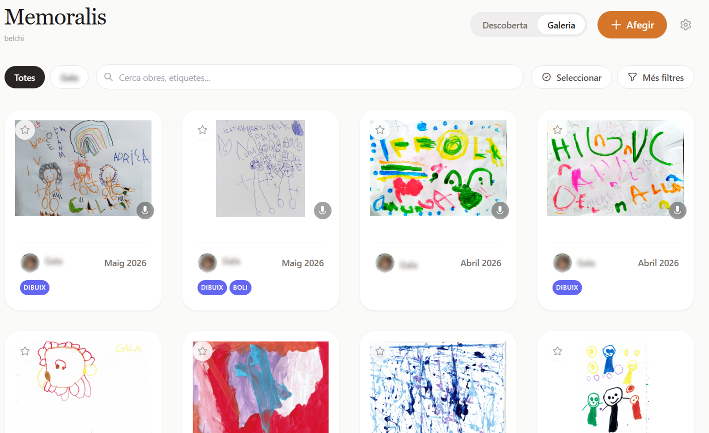

## Memoralis

[](./LICENSE)
[](https://github.com/ibelchi/memoralis)
[](https://nextjs.org)
[](https://www.docker.com)

> *Les obres dels infants mereixen ser escoltades, no només mirades.*

Memoralis és una app per arxivar les creacions dels infants de la teva familia: dibuixos, manualitats, fotografies... El que la fa diferent és que cada obra pot portar una gravació de la veu del nen o nena explicant el que ha creat. Un record en dues dimensions: visual i sonora.

Creada per ús propi, ara compartida per si a algú li pot ser útil.

---


*La galeria principal amb els dos modes: Descoberta (aleatori) i Galeria (cronològic)*

---

## ✨ Funcionalitats

- 🖼️ Arxiva dibuixos, fotos, manualitats i PDFs (convertits automàticament a imatges)
- 🎙️ Associa àudios a cada obra — la veu de la creadora, explicant el que ha fet
- 👧 Perfils per autora amb avatar i color identificador
- ⭐ Marca favorits i descobreix obres aleatòriament
- 📅 "Avui fa X anys" — cada dia et recorda les obres creades en la mateixa data d'anys anteriors
- ✂️ Editor d'imatges integrat: gira i retalla sense sortir de l'app
- 🔍 Cerca per text, filtre per autora, per etiquetes i per rang de dates
- 💾 Backup d'un sol clic: ZIP amb tota la base de dades i els fitxers
- 📱 Instal·lable com a PWA al mòbil

---

## 🚀 Quick Start

Necessites **Docker** i **Docker Compose**.

### 1. Clona el repositori

```bash
git clone https://github.com/ibelchi/memoralis.git
cd memoralis
```

### 2. Copia i configura les variables d'entorn

```bash
cp .env.example .env
```

Edita `.env` si vols canviar algun valor (per defecte tot funciona sense tocar res).

### 3. Arrenca amb Docker Compose

```bash
docker compose up -d
```

### 4. Obre l'app

```
http://localhost:3000
```

La base de dades es crea automàticament en el primer arrencament. Les imatges i àudios es guarden al directori `./media/` de la teva màquina.

---

## ⚙️ Configuració

| Variable | Valor per defecte | Descripció |
|---|---|---|
| `DATABASE_URL` | `file:./dev.db` | Path a la base de dades SQLite |
| `MEDIA_PATH` | `./media` | Directori on es guarden els fitxers pujats |

**Port:** L'app corre al port `3000`. Pots canviar-lo al `docker-compose.yml` (`3000:3000` → `8080:3000`, per exemple).

**Volums persistits** (no els toquis si no vols perdre dades):
- `./dev.db` — la base de dades
- `./media/` — totes les imatges i àudios

---

## 🛠 Stack tecnològic

| Capa | Tecnologia |
|---|---|
| Framework | Next.js 14 (App Router, TypeScript) |
| Estils | Vanilla CSS + Tailwind CSS |
| Base de dades | SQLite via Prisma 7 |
| Storage | Sistema de fitxers local (`/media`) |
| Processament PDF | `pdfjs-dist` + `canvas` |
| Desplegament | Docker Compose |

---

## 🗺 Roadmap

### v1.1 (si sorgeix la necessitat)
- Cerca per veu (Web Speech API)
- Export selectiu d'una obra per compartir
- Densitat de quadrícula configurable
- Notes privades de context per obra

### Fase 7 — Captura offline mòbil (pendent de decidir)
Poder fotografiar i enregistrar obres des del mòbil sense necessitat que el servidor estigui engegat, i sincronitzar quan s'arribi a casa. Dues opcions sobre la taula: PWA amb mode offline o una pàgina de captura standalone instal·lable per separat.

---

## 🤝 Contributing

Memoralis és un projecte personal obert. Si t'has auto-hostatjat i vols afegir alguna cosa, ets benvingut.

No hi ha gaires regles: obre una issue explicant el que vols fer, i si té sentit per al projecte, endavant. PRs petits i enfocats, si us plau.

El projecte no vol créixer en totes les direccions — la filosofia KISS és intencional.

---

## 📄 Llicència

[MIT](./LICENSE) © 2026 ibelchi

---

*Made with ☕ and nostalgia by [belchi](https://ibelchi.github.io)*
